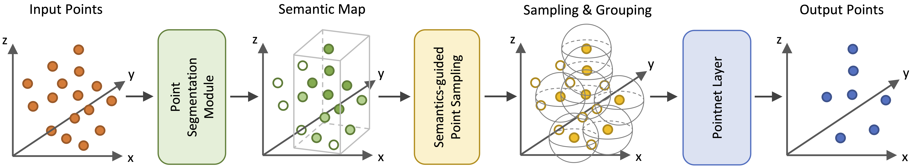

# Semantics-Augmented Set Abstraction (SASA)

By Chen Chen, Zhe Chen, Jing Zhang, and Dacheng Tao

This repository is the code release of the paper [SASA: Semantics-Augmented Set Abstraction for Point-based 3D Object Detection](https://arxiv.org/abs/2201.01976), accepted by AAAI 2022.

## Introduction

**TL; DR.**  We develop a new set abstraction module named *Semantics-Augmented Set Abstraction* (SASA) for point-based 3D detectors. It could largely enhance the feature learning by helping extracted point representations better focus on meaningful foreground regions.

<p align="center">
  
</p>

**Abstract.** Although point-based networks are demonstrated to be accurate for 3D point cloud modeling, they are still falling behind their voxel-based competitors in 3D detection. We observe that the prevailing set abstraction design for down-sampling points may maintain too much unimportant background information that can affect feature learning for detecting objects. To tackle this issue, we propose a novel set abstraction method named Semantics-Augmented Set Abstraction (SASA). Technically, we first add a binary segmentation module as the side output to help identify foreground points. Based on the estimated point-wise foreground scores, we then propose a semantics-guided point sampling algorithm to help retain more important foreground points during down-sampling. In practice, SASA shows to be effective in identifying valuable points related to foreground objects and improving feature learning for point-based 3D detection. Additionally, it is an easy-to-plug-in module and able to boost various point-based detectors, including single-stage and two-stage ones. Extensive experiments validate the superiority of SASA, lifting point-based detection models to reach comparable performance to state-of-the-art voxel-based methods.


## Main Results

Here we present experimental results evaluated on the KITTI *validation* set and the corresponding pretrained models.

| Method | Easy | Moderate | Hard | download |
|:-------|:----:|:--------:|:----:|:--------:|
| [3DSSD](tools/cfgs/kitti_models/3dssd.yaml) | 91.53 | 83.12 | 82.07 | [Google Drive](https://drive.google.com/file/d/1KG5a1MiGGtkgMpMGdn9mGgwpeOAbdwgK/view?usp=sharing)
| [3DSSD + **SASA**](tools/cfgs/kitti_models/3dssd_sasa.yaml) | **92.34** | **85.91** | **83.08** | [Google Drive](https://drive.google.com/file/d/1VxQ79V0Kp8Gum--rs5HdOe2DHnbcLoo8/view?usp=sharing)
| [PointRCNN](tools/cfgs/kitti_models/pointrcnn.yaml) | 91.80 | 82.35 | 80.21 | [Google Drive](https://drive.google.com/file/d/1f0RnwOz7zDahdhcHJHxct6BX-Xu0_0sp/view?usp=sharing)
| [PointRCNN + **SASA**](tools/cfgs/kitti_models/pointrcnn_sasa.yaml) | **92.25** | **82.80** | **82.23** | [Google Drive](https://drive.google.com/file/d/19uUunoeeAAVLJ64Bn1chOPBroHe-5JaN/view?usp=sharing)

## Getting Started

### Requirements
* Linux
* Python >= 3.6
* PyTorch >= 1.3
* CUDA >= 9.0
* CMake >= 3.13.2
* [`spconv v1.2`](https://github.com/traveller59/spconv/tree/v1.2.1)

### Installation
a. Clone this repository.
```shell
git clone https://github.com/blakechen97/SASA.git
cd SASA
```

b. Install `spconv` library.
```shell
git clone https://github.com/traveller59/spconv.git
cd spconv
git checkout v1.2.1
git submodule update --init --recursive
python setup.py bdist_wheel
pip install ./dist/spconv-1.2.1-cp36-cp36m-linux_x86_64.whl   # wheel file name may be different
cd ..
```

c. Install `pcdet` toolbox.
```shell
pip install -r requirements.txt
python setup.py develop
```

### Data Preparation
a. Prepare datasets.
```
SASA
├── data
│   ├── kitti
│   │   ├── ImageSets
│   │   ├── training
│   │   │   ├──calib & velodyne & label_2 & image_2 & (optional: planes)
│   │   ├── testing
│   │   ├── calib & velodyne & image_2
│   ├── nuscenes
│   │   ├── v1.0-trainval (or v1.0-mini if you use mini)
│   │   │   ├── samples
│   │   │   ├── sweeps
│   │   │   ├── maps
│   │   │   ├── v1.0-trainval  
├── pcdet
├── tools
```

b. Generate data infos.
```shell
# KITTI dataset
python -m pcdet.datasets.kitti.kitti_dataset create_kitti_infos tools/cfgs/dataset_configs/kitti_dataset.yaml

# nuScenes dataset
pip install nuscenes-devkit==1.0.5
python -m pcdet.datasets.nuscenes.nuscenes_dataset --func create_nuscenes_infos \ 
    --cfg_file tools/cfgs/dataset_configs/nuscenes_dataset.yaml \
    --version v1.0-trainval
```

### Training
* Train with a single GPU:
```shell script
python train.py --cfg_file ${CONFIG_FILE}
```

* Train with multiple GPUs:
```shell script
sh scripts/dist_train.sh ${NUM_GPUS} --cfg_file ${CONFIG_FILE}
```

### Testing
* Test a pretrained model with a single GPU:
```shell script
python test.py --cfg_file ${CONFIG_FILE} --ckpt ${CKPT}
```

Please check [GETTING_STARTED.md](docs/GETTING_STARTED.md) to learn more usage of `OpenPCDet`.


## Acknowledgement
This project is built with `OpenPCDet` (version `0.3`), a powerful toolbox for LiDAR-based 3D object detection. Please refer to [OpenPCDet.md](OpenPCDet.md) and the [official github repository](https://github.com/open-mmlab/OpenPCDet) for more information.


## License
This project is released under the [Apache 2.0 license](LICENSE).

## Citation 
If you find this project useful in your research, please consider cite:

```
@article{chen2022sasa,
  title={SASA: Semantics-Augmented Set Abstraction for Point-based 3D Object Detection},
  author={Chen, Chen and Chen, Zhe and Zhang, Jing and Tao, Dacheng},
  journal={arXiv preprint arXiv:2201.01976},
  year={2022}
}
```
